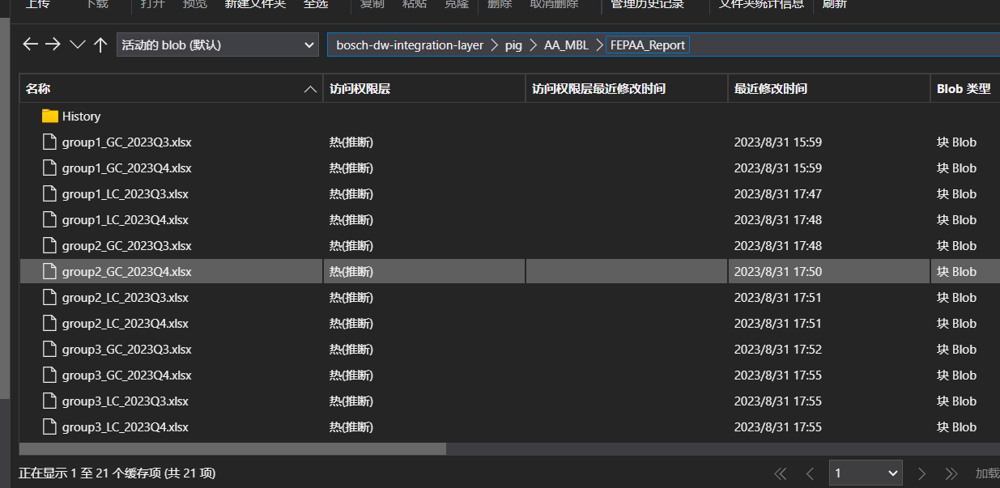

## FEPAA 链路开发文档

### 一、项目背景

	该项目主要围绕博世PIG数据，主指标需求为料号、货币、币种、金额等。其目的是为了将PIG系统数据，解析同步到DataSimba数据中台中，减少数据使用成本，实现可复用性数据的自动化产出。

> 		由于DataSimba的一些局限性，无法通过脚本直接将解析结果插入hive中，所以为完成解析及初始化同步，采取分批落盘到资源文件中，再由资源文件抽取到hive表的同步策略。
> 
> 局限性说明：
> 
> 	1、解析所用openpyxl模块只能为python作业应用，但python作业无法与hive表交互
> 
> 	2、pyspark作业可以与hive进行交互，但是没有openpyxl包
> 
> 	3、python作业中台限制运行时常1小时，遂分批初始化

 

### 二、数据源

	1、PIG FEPAA数据通过NFS文档服务器，由bosch redlake工具实现 Azure blob 数据同步中转，其样式为：

历史数据：

 

每月增量：

 

### 三、转换策略

 

 

**Step1**：NFS文档服务中数据文件 通过redlake工具刷到Azure blob中存储

**Step2**：DataSimba中用python对blob的xlxs文件进行解析，生成所需表样式，落到资源文件csv中

- 初始化：每10个文件一批，运行落到history csv中
- 月增量：直接5个文件（group），运行落到month csv中

**Step3**：STG增量数据表数据同步（month csv）

**Step4**：ODS全量数据表数据同步（history merge month）

- 初始化：history csv中抽取数据进入ODS表
- 月增量：STG表 merge ODS表已有数据，再插入ODS表

**Step5**：链路调度时间为每月8日凌晨0点

 

### 四、逻辑说明

见BRD文档：[FEPAA 需求文档快照版](https://bosch.sharepoint.com/:w:/r/sites/msteams_2006198/Shared%20Documents/General/20%20Resource%20management/10%20Weekly%20Report/Leansight%20Wang%20Zhaoxiang/material/FEPAA%20from%20PIG%20parsing%20rules_20230810.docx?d=w59f1039525ab49d7a7a6305df1baefc2&csf=1&web=1&e=Ec5ryE)
